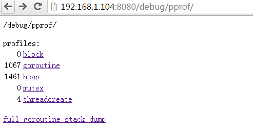

数据结构ServerRunOptions
======================================================================
## 简介
ServerRunOptions结构体表示服务器运行参数，用于接收flag参数。在后面的Run函数中，ServerRunOptions中的值又会赋给master.Config结构体，用于服务器运行时。

## 1. 数据结构ServerRunOptions
含义：

    服务器的运行参数。

路径：

    k8s.kubernetes/cmd/kube-apiserver/app/options/options.go

定义：

    type ServerRunOptions struct {
        GenericServerRunOptions     *genericoptions.ServerRunOptions                //服务器通用的运行参数
        Etcd                        *genericoptions.EtcdOptions                     //etcd相关参数
        SecureServing               *genericoptions.SecureServingOptions            //安全服务器参数
        InsecureServing             *kubeoptions.InsecureServingOptions             //非安全服务器参数
        Audit                       *genericoptions.AuditOptions                    //审计参数
        Features                    *genericoptions.FeatureOptions                  //特征参数
        Admission                   *genericoptions.AdmissionOptions                //准入控制参数
        Authentication              *kubeoptions.BuiltInAuthenticationOptions       //认证参数
        Authorization               *kubeoptions.BuiltInAuthorizationOptions        //授权参数
        CloudProvider               *kubeoptions.CloudProviderOptions               //云提供商参数
        StorageSerialization        *kubeoptions.StorageSerializationOptions        //存储版本参数
        APIEnablement               *kubeoptions.APIEnablementOptions               //API可用集参数

        AllowPrivileged              bool
        EnableLogsHandler            bool
        EventTTL                     time.Duration
        KubeletConfig                kubeletclient.KubeletClientConfig
        KubernetesServiceNodePort    int
        MasterCount                  int
        MaxConnectionBytesPerSec     int64
        ServiceClusterIPRange        net.IPNet
        ServiceNodePortRange         utilnet.PortRange
        SSHKeyfile                   string 
        SSHUser                      string
        ProxyClientCertFile          string
        ProxyClientKeyFile           string
        EnableAggregatorRouting      bool
    }

下面对ServerRunOptions结构体中的字段进行详细说明：
### 1.1 GenericServerRunOptions字段
含义：

    服务器通用运行参数。

路径：

    k8s.kubernetes/vendor/k8s.io/apiserver/pkg/server/options/server_run_options.go

定义：

    //这里的ServerRunOptions结构体表示GenericServerRunOptions。后面使用该结构体时还会再次分析它。
    type ServerRunOptions struct {
        AdvertiseAddress            net.IP    //此处flag："--advertise-address=<nil>"。把自己的ip广播给集群中其他组件。后面会修改该默认值，即如果该字段为空，则使用"--bind-address"；如果未设置"--bind-address"，则使用host默认的网络接口。建议设置该flag参数。
        CorsAllowedOriginList       []string  //flag："--cors-allowed-origins=[]"。CORS（Cross-Origin Resource Sharing，跨域资源共享）允许的域列表。
        ExternalHost                string    //此处flag："--external-hostname="。用于产生master对外URL的主机名。例如Swagger API Docs。后面可能会修改该默认值，如果是gce或aws云，则会修改该默认值。
        MaxRequestsInFlight         int       //flag："--max-requests-inflight=400"。最大并发请求数。超过该值，拒绝请求，0值表示不限制请求数。
        MaxMutatingRequestsInFlight int       //flag："--max-mutating-requests-inflight=200"。和MaxRequestsInFlight类似，表示的是mutating请求。Mutating请求指的是被拦截修改后的请求。
        MinRequestTimeout           int       //flag："--min-request-timeout=1800"。最小请求超时时间，仅用于watch请求。
        TargetRAMMB                 int       //此处flag："--target-ram-mb=0"。apiserver内存限制，单位MB，整个集群node使用的最大内存。用于配置缓存，等等。后面会修改该默认值。
        WatchCacheSizes             []string  //此处flag："--watch-cache-sizes=[]"。各资源对象的watch缓存大小列表，以逗号分隔，格式为：resource1#size1,resource2#size2...。当EnableWatchCache为true时有效。后面会修改该默认值。
    }

在设置通用参数时，还有一个flag很重要："--feature-gates"。

#### 1.1.1 feature-gates
含义：

    一组特征开关，描述alpha/实验版本。格式为：key1=value1,key2=value2...。选项有：
    Accelerators=true|false (ALPHA - default=false)
    AdvancedAuditing=true|false (ALPHA - default=false)
    AffinityInAnnotations=true|false (ALPHA - default=false)
    AllAlpha=true|false (ALPHA - default=false)
    AllowExtTrafficLocalEndpoints=true|false (default=true)
    AppArmor=true|false (BETA - default=true)
    DynamicKubeletConfig=true|false (ALPHA - default=false)
    DynamicVolumeProvisioning=true|false (ALPHA - default=true)
    ExperimentalCriticalPodAnnotation=true|false (ALPHA - default=false)
    ExperimentalHostUserNamespaceDefaulting=true|false (BETA - default=false)
    LocalStorageCapacityIsolation=true|false (ALPHA - default=false)
    PersistentLocalVolumes=true|false (ALPHA - default=false)
    RotateKubeletClientCertificate=true|false (ALPHA - default=false)
    RotateKubeletServerCertificate=true|false (ALPHA - default=false)
    StreamingProxyRedirects=true|false (BETA - default=true)
    TaintBasedEvictions=true|false (ALPHA - default=false)

执行步骤：

1. DefaultFeatureGate - 共享的全局特征开关。

        // 路径：k8s.io/kubernetes/vendor/k8s.io/apiserver/pkg/util/feature/feature_gate.go
        var DefaultFeatureGate FeatureGate = NewFeatureGate()

        // FeatureGate接口用于解析和存储flag："--feature-gates"。
        type FeatureGate interface{
            AddFlag(fs *pflag.FlagSet)                                //重点关注AddFlag方法，该方法把flag"--feature-gates"注册的命令行FlagSet中。
            Set(value string) error
            Enabled(key Feature) bool
            Add(features map[Feature]FeatureSpec) error               //Add方法往DefaultFeatureGate.known中增加feature。
            KnownFeatures() []string
        }

        // 创建featureGate结构体。featureGate实现了FeatureGate接口，这里就不列出FeatureGate的所有方法了。
        func NewFeatureGate() *featureGate{
            f := &featureGate{
                //AllAlpha是默认feature gate，会被覆盖。
                known: map[string]FeatureSpec{
                   "AllAlpha": {Default: false, PreRelease: Alpha},
                },
                special: map[string]func(f *featureGate, val bool){
                    "AllAlpha": setUnsetAlphaGates,
                }
                enabled: map[string]bool{},
            }
            return f
        }

        type featureGate struct{
            known   map[string]FeatureSpec
            special map[string]func(*featureGate, bool)               //special的作用是什么？
            enabled map[string]bool                                   //enabled的作用是什么？
            closed  bool                                              //当调用AddFlag时，设置为true。Add判断为true时，会错误退出。注意：初始化不是go-routine安全，查询是go-routine安全的。
        }
        type FeatureSpec struct{
            Default bool
            PreRelease string
        }
        func setUnsetAlphaGates(f *featureGate, val bool){
            for k,v := range f.known {
                if v.PreRelease == Alpha{
                    if _, found := f.enabled[k]; !found{
                        f.enabled[k] = val
                    }
                }
            }
        }
        const(
            Alpha = "ALPHA"
            Beta  = "BETA"
            GA    = ""
        )

2. init()初始化，往DefaultFeatureGate.known中增加feature。

        // k8s.io/kubernetes/vendor/k8s.io/apiserver/pkg/features/kube-features.go
        func init(){
            utilfeature.DefaultFeatureGate.Add(defaultKubernetesFeatureGates)
        }

        var defaultkubernetesFeatureGates = map[string]utilfeature.FeatureSpec{
            StreamingProxyRedirects: {Default: true, PreRelease: utilfeature.Beta},
            AdvancedAuditing: {Default: false, PreRelease: utilfeature.Alpha},
        }

        // k8s.io/kubernetes/vendor/k8s.io/apiserver/pkg/util/feature/feature_gate.go
        // Add的目的是往known中增加feature gate。
        // 如果已经执行了AddFlag，则closed被设置为true，再执行Add会错误退出。Add增加重复选项时值必须相同，否则错误退出。
        func (f *featureGate) Add(features map[string]FeatureSpec) error{
            if f.closed{
                return fmt.Errorf("cannot add a feature gate after adding it to the flag set")
            }
            for name, spec := range features{
                if existingSpec, found:=f.known[name]; found{
                    if existingSpec == spec{
                        continue
                    }
                    return fmt.Errorf("feature gate %q with different spec already exists: %v", name, existingSpec)
                }
                f.known[name] = spec
            }
            return nil
        }

        // k8s.io/kubernetes/pkg/features/kube_features.go
        func init(){
            utilfeature.DefaultFeatureGate.Add(defaultKubernetesFeatureGates)
        }
        var defaultKubernetesFeatureGates = map[string]utilfeature.FeatureSpec{
            ExternalTrafficLocalOnly: {Default: true, PreRelease: utilfeature.GA},
            AppArmor: {Default: true, PreRelease: utilfeature.Beta},
            DynamicKubeletConfig: {Default: false, PreRelease: utilfeature.Alpha},
            DynamicVolumeProvisioning: {Default: true, PreRelease: utilfeature.Alpha},
            ExperimentalHostUserNamespaceDefaultingGate: {Default: false, PreRelease: utilfeature.Beta},
            ExperimentalCriticalPodAnnotation: {Default: false, PreRelease: utilfeature.Alpha},
            AffinityInAnnotations: {Default: false, PreRelease: utilfeature.Alpha},
            Accelerators: {Default: false, PreRelease: utilfeature.Alpha},
            TaintBasedEvictions: {Default: false, PreRelease: utilfeature.Alpha},
            RotateKubeletServerCertificate: {Default: false, PreRelease: utilfeature.Alpha},
            RotateKubeletClientCertificate: {Default: false, PreRelease: utilfeature.Alpha},
            PersistentLocalVolumes: {Default: false, PreRelease: utilfeature.Alpha},
            LocalStorageCapacityIsolation: {Default: false, PreRelease: utilfeature.Alpha}

            // inherited features from generic apiserver, relisted here to get a conflict if it is changed unintentionally on either side:
            StreamingProxyRedirects: {Default: true, PreRelease: utilfeature.Beta},
            genericfeatures.AdvancedAuditing: {Default: false, PreRelease: utilfeature.Alpha},
        }

3. 把flag"--feature-gates"加入命令行FlagSet中

        调用顺序如下：
        //k8s.io/kubernetes/cmd/kube-apiserver/apiserver.go
        func main(){
            ...
            s:=options.NewServerRunOptions()
            s.AddFlags(pflag.CommandLine)
            ...
        }
        //k8s.io/kubernetes/cmd/kube-apiserver/app/options/options.go
        func (s *ServerRunOptions) AddFlags(fs *pflag.FlagSet){
            s.GenericServerRunOptions.AddUniversalFlags(fs)
            ...
        }
        //k8s.io/kubernetes/vendor/k8s.io/apiserver/pkg/server/options/server_run_options.go
        func (s *ServerRunOptions) AddUniversalFlags(fs *pflag.FlagSet){
            ...
            utilfeature.DefaultFeatureGate.AddFlag(fs)
        }
        //k8s.io/kubernetes/vendor/k8s.io/apiserver/pkg/util/feature/feature_gate.go
        func (f *featureGate) AddFlag(fs *pflag.FlagSet){
            f.closed = true
            known:=f.KnownFeatures()
            fs.Var(f,flagName, "A set of key=value pairs that describe feature gates for alpha/experimental features. Options are:\n"+strings.Join(known, "\n"))
        }
        func (f *featureGate) KnownFeatures() []string{
            var known []string
            for k,v := range f.known{
                pre := ""
                if v.PreRelease != GA{
                    pre = fmt.Sprintf("%s - ", v.PreRelease)
                }
                known = append(known, fmt.Sprintf("%s=true|false (%default=%t)", k, pre, v.Default))
            }
            sort.Strings(known)
            return known
        }

### 1.2 Etcd字段
含义：

    etcd相关配置。

路径：

    k8s.io/kubernetes/vendor/k8s.io/apiserver/pkg/server/options/etcd.go

定义：

    type EtcdOptions struct{
        StorageConfig                    storagebackend.Config   //后端存储（etcd）的配置
        EncryptionProviderConfigFilepath string                  //flag："--experimental-encryption-provider-config="。该配置文件供加密提供商用来在etcd中存储secrets。
        EtcdServersOverrides             []string                //flag："--etcd-servers-overrides=[]"。etcd servers覆盖的每个资源，逗号分隔，格式：group/resource#servers，其中servers格式：http://ip:port。
        DefaultStorageMediaType          string                  //flag："--storage-media-type=application/vnd.kubernetes.protobuf"。etcd默认存储MIME类型。
        DeleteCollectionWorkers          int                     //flag："--delete-collection-workers=1"。调用DeleteCollection方法启动的线程数量，用于提高namespace清理速度。
        EnableGarbageCollection          bool                    //flag："--enable-garbage-collector=true"。是否打开gc，必须和kube-controller-manager相应的flag同步。
        EnableWatchCache                 bool                    //flag："--watch-cache=true"。是否打开所有对象的watch cache功能。
        DefaultWatchCacheSize            int                     //无flag。默认的watch cache大小。此处默认值：100。单位是MB。
    }

#### 1.2.1 StorageConfig
含义：

    etcd后端存储的配置参数。

路径：

    k8s.io/kubernetes/vendor/k8s.io/apiserver/pkg/storage/storagebackend/config.go

定义：

    type Config struct{
        Type                     string                //flag："--storage-backend="。后端存储（storage backend）类型，例如："etcd2"，"etcd3"，默认""表示"etcd3"。
        Prefix                   string                //flag："--etcd-prefix=/registry"。etcd中所有资源路径的前缀。
        ServerList               []string              //flag："--etcd-servers=[]"。与apiserver连接的etcd server列表，格式：scheme://ip:port，逗号分隔。该参数通过命令行传入，必须被设置。
        KeyFile                  string                //flag："--etcd-keyfile="。apiserver和etcd安全连接的TLS秘钥文件（包含公钥和私钥）。
        CertFile                 string                //flag："--etcd-certfile="。apiserver和 etcd安全连接的TLS证书文件。
        CAFile                   string                //flag："--etcd-cafile="。apiserver和 etcd安全连接的TLS CA证书文件。
        Quorum                   bool                  //flag："--etcd-quorum-read=false"。设置read quorum。
        DeserializationCacheSize int                   //此处flag："--deseriazation-cache-size=0"。反序列化json对象的缓存大小，当前仅支持etcd2。一旦使用protobuf，就去除这个缓存。后面可能会修改该默认值，即如果默认值为0，则根据TargetRAMMB进行设置，或者通过命令行flag传入。
        Codec                    runtime.Codec         //无falg。
        Copier                   runtime.ObjectCopier  //无falg。
        Transformer              value.Transformer     //无falg。允许数据在持久化到etcd之前进行转换。
    }

1. Quorum

        Quorum机制是解决分布式系统的数据一致性问题的一种方法。为了保证分布式系统的可靠性，对于数据的存储采用多份数据副本，也就是其中一个节点上读取数据失败了那么可以转向另外一个存有相同数据副本的节点读取返回给用户。对于写操作，要保证所有副本都更新成功才给用户返回信息，用户才可以读取。这种方案存在的问题是：写操作时延较大，写并发也有很大影响。能否有一种方案可以不更新完全部数据，就能保证用户读取到更新后的数据呢？Quorum就是一种解决方案。

        先介绍一下抽屉模型：有两个抽屉，一个抽屉装了2个红苹果，另一个抽屉装了2个青苹果，如果拿取3个苹果，必有1个是红苹果。

        如果抽屉模型中的红苹果代表已更新的数据，青苹果代表未更新的数据。可以看出不需要更新完全部数据就可以取出已更新的数据。Quorum机制的实质是将写的部分负载转移给了读负载，读多个副本使得写不会过于劳累。
    
        下面介绍Quorum机制是怎么解决读写负载均衡的：
        假设总共有N个数据副本，其中k个已更新，N-k个未更新，那么任意读取N-k+1个数据就必定有1个数据是更新后的，只要取N-k+1中版本最高的数据给用户即可。对于写操作，只需要完成N个副本的更新后，就可以告诉用户操作完成，而不需要全部更新，当然在告诉用户更新完成后，系统内部会慢慢的更新剩余的数据副本，这对用户是透明的。
        
        在kubernetes中，默认不使用Qurorum机制。

2. Codec

含义：对象序列化和反序列化。详细内容请看参考文献[[Serializer序列化器]](../../reference/k8s/serializer.md/)

路径：

    k8s.io/kubernetes/vendor/k8s.io/apimachinery/pkg/runtime/interfaces.go

定义：

    type Codec Serializer                      //Codec处理版本对象的序列化和反序列化。Codec类型对象需要实现Serializer接口。
    type Serializer interface{
        Encoder
        Decoder
    }
    type Encoder interface{
        Encode(obj Object, w io.Writer) error  //将对象写到一个流中。如果版本不兼容，或者没有定义conversion，则返回错误。
    }
    type Decoder interface{
        //将data反序列化为对象，使用scheme本来的类型或者提供的defaults类型。返回对象和类型。如果into不为nil，将被用作目的类型，可能会使用它而不是重新分配一个对象。尽管如此，不保证填充这个对象，返回的对象也不保证匹配。如果提供defaults，默认会被用于data。
        Decode(data []byte, defaults *schema.GroupVersionKind, into Object) (Object, *schema.GroupVersionKind, error)
    }

3. Copier

含义：复制对象。

路径：

    k8s.io/kubernetes/vendor/k8s.io/apimachinery/pkg/runtime/interfaces.go

定义：

    //复制对象
    type ObjectCopier interface{
        Copy(Object) (Object, error)                 //返回对象的精确拷贝，如果拷贝未完成，则返回error。
    }

    //Scheme中注册的所有API type都必须实现Object接口，因为序列化/反序列化对象需要使用gvk，而Object接口就是提供对象的gvk。
    type Object interface{
        GetObjectKind() schema.ObjectKind
    }

    //k8s.io/kubernetes/vendor/k8s.io/apimachinery/pkg/runtime/schema/interfaces.go
    type ObjectKind interface{
        SetGroupVersionKind(kind GroupVersionKind)   //设置对象的gvk
        GroupVersionKind() GroupVersionKind          //获取对象的gvk
    }

    //k8s.io/kubernetes/vendor/k8s.io/apimachinery/pkg/runtime/schema/group_version.go
    type GroupVersionKind struct{
        Group string
        Version string
        Kind string
    }

4. Transformer

含义：

    转换器。

路径：

    k8s.io/kubernetes/vendor/k8s.io/apimachinery/pkg/runtime/interfaces.go

定义：

    //Transformer接口允许数据在从后端存储中读取或者存入后端存储中之前进行转换。接口的方法必须能撤销由其它原因导致的转换。
    type Transformer interface{
        TransformFromStorage(data []byte, context Context) (out []byte, stale bool, err error)  //转换来自后端存储的数据或者返回错误。如果磁盘上对象过期了，则设置stale为true，并且要往etcd中写数据，即使数据内容没有改变。
        TransformToStorage(data []byte, context Context) (out []byte, err error)                //转换数据到后端存储或返回错误。
    }

### 1.3 SecureServing字段
含义：

    安全服务器配置参数。

路径：

    k8s.io/kubernetes/vendor/k8s.io/apiserver/pkg/server/options/serving.go

定义：

    type SecureServingOptions struct{
        BindAddress net.IP                       //flag："--bind-address=0.0.0.0"。apiserver安全监听ip，和"--secure-port"一起用。如果空表示接受所有接口（0.0.0.0）。
        BindPort    int                          //flag："--secure-port=6443"。apiserver监听port。如果为0表示不支持https。
        ServerCert  GenerableKeyCert             //TLS证书
        SNICertKeys []utilflag.NamedCertKey      //命名的CertKeys，支持SNI。flag："--tls-sni-cert-key=[]"。解析"certfile,keyfile"和"certfile,keyfile:name,name,name"的flag值。例如："example.crt,example.key"或者"foo.crt,foo.key:*.foo.com,foo.com"。
    }

#### 1.3.1 ServerCert
含义：

    TLS证书。

路径：

    k8s.io/kubernetes/vendor/k8s.io/apiserver/pkg/server/options/serving.go

定义：

    type GenerableKeyCert struct{
        CertKey       CertKey                    //证书文件和秘钥文件（包含公钥和私钥）的路径。
        CACertFile    string                     //CA证书。默认值：""。对应的flag是："--tls-ca-file"。
        CertDirectory string                     //flag："--cert-dir=/var/run/kubernetes"。证书存放目录。如果设置了"--tls-cert-file"和"--tls-private-key-file"，该参数将被忽略。
        PairName      string                     //无flag。默认值："apiserver"。和CertDirectory一起使用，决定cert和key的名字。格式：CertDirector/PairName.crt和CertDirector/PairName.key。
    }
    type CertKey struct{
        //如果未提供CertFile和KeyFile，则生成自签名证书和私钥，保存在/var/run/kubernetes目录中。
        CertFile string                          //证书文件。默认值：""。对应的flag是："--tls-cert-file"。
        KeyFile  string                          //秘钥文件（包含公钥和私钥）。默认值：""。对应的flag是："--tls-private-key-file"。
    }
    
#### 1.3.2 SNICertKeys
含义：
    SNI根据客户端请求的域名不同，会分配不同的证书给客户端。SNI的详细内容请看参考文献[[SNI-TLS原理]](../../reference/crypto/sni-tls.md)

路径：

    k8s.io/kubernetes/vendor/k8s.io/apiserver/pkg/util/flag/namedcertkey_flag.go

定义：

    type NamedCertKey struct{
        Names             []string      //域名
        CertFile, KeyFile string        //证书和秘钥
    }

### 1.4 InsecureServing字段
含义：

    非安全方式，不应该使用这种方式。应该使用安全模式。

路径：

    k8s.io/kubernetes/pkg/kubeapiserver/options/serving.go

定义：

    type InsecureServingOptions struct{
        BindAddress net.IP                  //flag："--insecure-bind-address=127.0.0.1"。
        BindPort    int                     //flag："--insecure-port=8080"。
    }

### 1.5 Audit字段
含义：

    审计参数。

路径：

    k8s.io/kubernetes/vendor/k8s.io/apiserver/pkg/server/options/audit.go

定义：

    type AuditOptions struct{
        PolicyFile     string                //flag："--audit-policy-file="。审计策略文件，过滤捕获到的审计事件。需要"AdvancedAuditing" feature gate。
        LogOptions     AuditLogOptions       //日志审计
        WebhookOptions AuditWebhookOptions   //webhook审计
    }

    //LogOptions定义：
    //如果AdvancedAuditing为true，则这些参数决定了审计日志的输出。
    type AuditLogOptions struct{
        Path       string                    //flag："--audit-log-path="。apiserver请求记录在审计日志中。"-"表示标准输出。
        MaxAge     int                       //flag："--audit-log-maxage=0"。保留旧审计日志的最大天数。基于文件名的时间戳。
        MaxBackups int                       //flag："--audit-log-maxbackup=0"。保留旧审计日志的最大数。
        MaxSize    int                       //flag："--audit-log-maxsize=0"。审计日志的最大兆字节数。
    }

    //WebhookOptions定义：
    type AuditWebhookOptions struct{ 
        ConfigFile string                    //flag："--audit-webhook-config-file="。webhook审计配置文件，需要"AdvancedAuditing" feature gate。
        Mode       string                    //flag："--audit-webhook-mode=batch"。webhook是异步批处理事件还是同步阻塞事件。
    }

### 1.6 Features字段
含义：

    设置特性开关。

路径：

    k8s.io/kubernetes/vendor/k8s.io/apiserver/pkg/server/options/feature.go

定义：

    type FeatureOptions struct{
        EnableProfiling           bool       //flag："--profiling=true"。性能分析开关。可以通过<host>:<port>/debug/pprof/地址来查看程序栈，线程等信息。
        EnableContentionProfiling bool       //flag："--contention-profiling=false"。
        EnableSwaggerUI           bool       //flag："--enable-swagger-ui=false"。swagger ui开关。
    }

下图是profiling获得的信息：

### 1.7 Admission字段
含义：

    准入控制参数。

路径：

    k8s.io/kubernetes/vendor/k8s.io/apiserver/pkg/server/options/admission.go

定义：

    type AdmissionOptions struct{
        PluginNames []string                                //此处flag："--admission-control=[AlwaysAdmit]"。准入控制插件列表，逗号分隔，按顺序执行。
        ConfigFile  string                                  //flag："--admission-control-config-file="。准入控制配置文件。
        Plugins     *admission.Plugins                      //无flag。后面会注册很多准入控制插件。
    }

    //k8s.io/kubernetes/vendor/k8s.io/apiserver/pkg/admission/plugins.go
    type Plugins struct{
        lock     sync.Mutex
        registry map[string]Factory
    }
    type Factory func(config io.Reader) (Interface, error)  //准入控制插件需要实现Interface接口，即实现Admit和Handles方法。后面还会详细介绍。

    //k8s.io/kubernetes/vendor/k8s.io/apiserver/pkg/admission/interfaces.go
    //Interface接口实现了准入控制插件所需的操作。
    type Interface interface{
        Admit(a Attributes) (err error)                     //基于请求属性的准入控制。
        Handles(operation Operation) bool                   //如果准入控制器能处理给定的操作，可能是CREATE、UPDATE、DELETE、CONNECT，则返回true。
    }
    type Operation string
    type Attributes interface{
        GetName()        string                             //请求对象的名字。在CREATE操作中，client可能会忽略这个名字，依靠server产生的名字，此时返回空字符串。
        GetNamespace()   string                             //请求的namespace。
        GetResource()    schema.GroupVersionResource        //请求的资源。
        GetSubresource() string                             //请求的子资源。例如：/pods/foo/status的资源"pods"，子资源是"status"，kind是"Pod"。
        GetOperation()   Operation                          //执行的操作。
        GetObject()      runtime.Object                     //来自请求的对象。
        GetOldObject()   runtime.Object                     //以存在的对象，仅用于UPDATE。
        GetKind()        schema.GroupVersionKind            //资源类型。
        GetUserInfo()    user.Info                          //请求的用户信息
    }

    //k8s.io/kubernetes/vendor/k8s.io/apimachinery/pkg/runtime/schema/group_version.go
    type GroupVersionResource struct{
        Group    string
        Version  string
        Resource string
    }

    //k8s.io/kubernetes/vendor/k8s.io/apiserver/pkg/authentication/user/user.go
    //Info描述已经被系统认证的用户。
    type Info interface{
        GetName()   string                                  //用户名
        GetUID()    string                                  //用户UID
        GetGroups() []string                                //用户所在组
        GetExtra()  map[string][]string                     
    }

### 1.8 Authentication字段
含义：

    认证参数。

路径：

    k8s.io/kubernetes/pkg/kubeapiserver/options/authentication.go

定义：

    type BuiltInAuthenticationOptions struct{ 
        Anonymous       *AnonymousAuthenticationOptions
        AnyToken        *AnyTokenAuthenticationOptions
        BootstrapToken  *BootstrapTokenAuthenticationOptions
        ClientCert      *genericoptions.ClientCertAuthenticationOptions
        Keystone        *KeystoneAuthenticationOptions
        OIDC            *OIDCAuthenticationOptions
        PasswordFile    *PasswordFileAuthenticationOptions
        RequestHeader   *genericoptions.RequestHeaderAuthenticationOptions
        ServiceAccounts *ServiceAccountAuthenticationOptions
        TokenFile       *TokenFileAuthenticationOptions
        WebHook         *WebHookAuthenticationOptions
    }

    //匿名认证
    type AnonymousAuthenticationOptions struct{
        Allow bool                        //此处flag："--anonymous-auth=true"。是否允许匿名请求apiserver的安全端口。匿名请求是指没有被其他身份验证方法拒绝的请求，apiserver会为这样的请求赋予用户名：system:anonymous和用户group：system:unauthenticated。这个请求将继续流向后面的环节：authorization和admission-control。后面可能会修改该默认值，即如果授权策略模式是AlwaysAllow，则修改该值为false。
    }

    //允许任意token，即insecure方式。
    type AnyTokenAuthenticationOptions struct{
        Allow bool                        //flag："--insecure-allow-any-token=false"。如果设置该参数，server将是insecure。运行任意token，并从token "username/group1,group2"中解析用户信息。
    }

    //Bootstrap前端框架认证
    type BootstrapTokenAuthenticationOptions struct{
        Allow bool                        //flag："--experimental-bootstrap-token-auth=false"。允许"kube-system" namespace中的"boostrap.kubernetes.io/token"类型secrets用于TLS bootstrapping认证。
    }

    //客户端认证
    //k8s.io/kubernetes/vendor/k8s.io/apiserver/pkg/server/options/authentication.go
    type ClientCertAuthenticationOptions struct{
        ClientCA string                   //flag："--client-ca-file="。CA证书用于验证客户端证书。
    }

    //keystone认证
    type KeystoneAuthenticationOptions struct{
        URL    string                     //flag："--experimental-keystore-url="。激活keystore认证插件。
        CAFile string                     //flag："--experimental-keystore-ca-file="。keystore使用的ca证书，用于认证keystore的服务端证书。如果未设置，则使用host的CA。
    }

    //OpenID认证
    type OIDCAuthenticationOptions struct{
        CAFile        string              //flag："--oidc-ca-file="。ca证书用于认证OpenID server证书，如果未设置，则使用host root CA。
        ClientID      string              //flag："--oidc-client-id="。client id用于OpenID连接client。如果设置了"--oidc-issuer-url"，该参数也必须设置。
        IssuerURL     string              //flag："--oidc-issuer-url="。OpenID issuer的URL，仅支持https。如果设置了，用于验证OIDC JSON Web Token（JWT）。
        UsernameClaim string              //flag："--oidc-username-claim=sub"。OpenID claim用作用户名。注意，除了默认值（'sub'）之外的claim并不保证是唯一和不可变的。这个参数是实验性的。
        GroupsClaim   string              //flag："--oidc-groups-claim="。用户组。这个参数是实验性的。
    }

    //basic auth认证
    type PasswordFileAuthenticationOptions struct{
        BasicAuthFile string              //flag："--basic-auth-file="。如果设置了，允许使用http basic认证服务安全端口。 
    }

    //请求头认证
    //k8s.io/kubernetes/vendor/k8s.io/apiserver/pkg/server/options/authentication.go
    type RequestHeaderAuthenticationOptions struct{
        UsernameHeaders     []string      //flag："--requestheader-username-headers=[]"。检查用户名的请求头列表。X-Remote-User是常量。
        GroupHeaders        []string      //flag："--requestheader-group-headers=[]"。检查组的请求头列表。建议X-Remote-Group。
        ExtraHeaderPrefixes []string      //flag："--requestheader-extra-headers-prefix=[]"。检查请求头前缀。建议X-Remote-Extra。
        ClientCAFile        string        //flag："--requestheader-client-ca-file="。CA证书用于认证客户端证书。执行于"--requestheader-username-headers"指定的用户名认证之前。
        AllowedNames        []string      //flag："--requestheader-allowed-names=[]"。客户端常用名称列表，允许提供"--requestheader-username-headers"指定的用户名。如果为空，任何客户端证书认证有效。
    }

    //serviceaccount认证
    type ServiceAccountAuthenticationOptions struct{
        KeyFiles []string                 //此处flag："--service-account-key-file=[]"。keyfile验证serviceaccount token。后面可能会修改该默认值，即如果未设置，则使用"--tls-private-key-file"。
        Lookup   bool                     //flag："--service-account-lookup=true"。如果为true，则serviceaccount token作为认证部分存在于etcd中。
    }

    //token file认证
    type TokenFileAuthenticationOptions struct{
        TokenFile string                  //flag："--token-auth-file="。token认证访问安全端口使用的token文件。
    }

    //webhook认证
    type WebHookAuthenticationOptions struct{
        ConfigFile string                 //flag："--authentication-token-webhook-config-file="。webhook配置，以kubeconfig格式的token认证。API server将查询远程访问以确定bearer token的身份认证。
        CacheTTL   time.Duration          //flag："--authentication-token-webhook-cache-ttl=2m0s"。从webhook token身份认证器缓存响应的时间。
    }

### 1.9 Authorization字段
含义：

    授权参数。

路径：

    k8s.io/kubernetes/pkg/kubeapiserver/options/authorization.go

定义：

    type BuildInAuthorizationOptions struct{
        Mode                        string         //flag："--authorization-mode=AlwaysAllow"。授权插件列表。逗号分隔。
        PolicyFile                  string         //flag："--authorization-policy-file="。授权策略文件，csv格式，和"--authorization-mode=ABAC"一起使用。
        WebhookConfigFile           string         //flag："--authorization-webhook-config-file="。webhook配置文件，kubeconfig格式，和"--authorization-mode=Webhook"一起使用。
        WebhookCacheAuthorizedTTL   time.Duration  //flag："--authorization-webhook-cache-authorized-ttl=5m0s"。从webhook授权器缓存授权的响应的时间。
        WebhookCacheUnauthorizedTTL time.Duration  //flag："--authorization-webhook-cache-unauthorized-ttl=30s"。从webhook授权器缓存未授权的响应的时间。
    }

### 1.10 CloudProvider字段
含义：

    云提供商参数。

路径：

    k8s.io/kubernetes/pkg/kubeapiserver/options/cloudprovider.go

定义：

    type CloudProviderOptions struct{
        CloudConfigFile string                     //flag："--cloud-config="。cloud provider配置文件。空表示没有配置文件。
        CloudProvider   string                     //flag："--cloud-provider="。cloud provider。空表示没有provider。
    }

### 1.11 StorageSerialization字段
含义：

    存储到etcd中对象的group和Version信息。

路径：

    k8s.io/kubernetes/pkg/kubeapiserver/options/storage_versions.go

定义：

    type StorageSerializationOptions struct{
        //格式：group1/version1,gourp2/version2,...。如果对象从一个group移到另一个group，可能指定格式：group1=group2/v1beta1,group3/v1beta1.
        //默认来自KUBE_API_VERSIONS环境变量的所有已经注册组的所有首选版本。
        //flag："--storage-versions=admission.k8s.io/v1alpha1,admissionregistration.k8s.io/v1alpha1,apps/v1beta1,authentication.k8s.io/v1,authorization.k8s.io/v1,autosacling/v1,batch/v1,certificates.k8s.io/v1beta1,componentconfig/v1alpha1,extensions/v1beta1,federation/v1beta1,imagepolicy.k8s.io/v1alpha1,networking.k8s.io/v1,policy/v1beta1,rbac.authorization.k8s.io/v1beta1,settings.k8s.io/v1alpha1,storage.k8s.io/v1,v1 "。
        StorageVersions        string
        DefaultStorageVersions string          //无flag。StorageVersions的默认值。
    }

### 1.12 APIEnablement字段
含义：

    打开或关闭哪些API资源，以获得一个最小集的API server，对正常的API server不需要该参数。

路径：

    k8s.io/kubernetes/pkg/kubeapiserver/options/api_enablement.go

定义：

    type APIEnablementOptions struct{
        //apis/<groupversion>key表示打开/关闭api version。apis/<groupversion>/<resource>表示打开/关闭api resource。api/all表示打开/关闭所有版本。api/legacy表示打开/关闭legacy版本，即/api。flag："--runtime-config=map[]"。
        RuntimeConfig utilflag.ConfigurationMap
    }
    //k8s.io/kubernetes/vendor/k8s.io/apiserver/pkg/util/flag/configuration_map.go
    type ConfigurationMap map[string]string

### 1.13 AllowPrivileged字段
flag："--allow-privileged=false"。是否允许特权容器。

### 1.14 EnableLogsHandler字段
flag："--enable-logs-handler=true"。如果为true，为apiserver logs安装一个/logs 处理器。默认为true。

### 1.15 EventTTL字段
flag："--event-ttl=1h0m0s"。

### 1.16 KubeletConfig字段
含义：

    访问kubelet的配置参数。

路径：

    k8s.io/kubernetes/pkg/kubelet/client/kubelet_client.go

定义：

    type KubeletClientConfig struct{
        Port                  uint                //flag："--kubelet-port=10250"。 kubelet server的默认端口。该参数已经被标记弃用，未来会被移除。
        ReadOnlyPort          uint                //flag："--kubelet-read-only-port=10255"。kubelet暴露的只读端口。目前heapster只能通过这个端口去监控状态，未来如果heapster能使用SSL endpoint方式，则将移除这个端口。所以现在该端口的usage说明为：deprecated，但是flag并没有MarkDeprecated。
        EnableHttps           bool                //flag："--kubelet-https=true"。kubelet连接使用https。
        PreferredAddressTypes []string            //flag："--kubelet-preferred-address-types=[Hostname InternalDNS InternalIP ExternalDNS ExternalIP] "。用于kubelet连接的首先NodeAddressTypes。从Node.NodeStatus.Addresses中选择一个地址。

        restclient.TLSClientConfig                //TLS配置
        BearerToken           string              //无flag。服务端需要Bearer认证。
        HTTPTimeout           time.Duration       //flag："--kubelet-timeout=5s"。kubelet的超时时间。
        Dial                  utilnet.DialFunc    //无flag。为客户端定制的dialer。
    }

    //restclient.TLSClientConfig参数的定义：
    //路径：k8s.io/kubernetes/vendor/k8s.io/client-go/rest/config.go
    type TLSClientConfig struct{
        Insecure bool                             //无flag。不验证tls，仅用于测试。
        ServerName string                         //无flag。该参数被传给server SNI，并在client端使用以检查服务器证书。如果该参数为空，则使用server hostname。
        CertFile string                           //TLS客户端证书。对应的flag是："--kubelet-client-certificate"。默认为""。
        KeyFile string                            //flag："--kubelet-client-key="。TLS客户端秘钥（包括公钥和私钥）。
        CAFile string                             //flag："--kubelet-certificate-authority="。TLS CA证书。
        CertData []byte                           //无flag。优先于CertFile。
        KeyData []byte                            //无flag。优先于KeyFile。
        CAData []byte                             //无flag。优先于CAFile。
    }

    //Dial参数的定义：
    //路径：k8s.io/kubernetes/vendor/k8s.io/apimachinery/pkg/util/net/http.go
    type DialFunc func(net, addr string) (net.Conn, error)

### 1.17 KubernetesServiceNodePort字段
flag："--kubernetes-service-node-port=0"。如果设置了该参数，表示service是NodePort类型，nodePort为该值。如果是0，表示service是ClusterIP类型。

### 1.18 MasterCount字段
flag："--apiserver-count=1"。master的个数。

### 1.19 MaxConnectionBytesPerSec字段
flag："--max-connection-bytes-per-sec=0"。限制每个用户连接的每秒最大字节数，当前仅用于长时间运行的请求。默认是0。

### 1.20 ServiceClusterIPRange字段
flag："--service-cluster-ip-range={<nil> <nil>}"。cluster ip范围，CIDR格式。

### 1.21 ServiceNodePortRange字段
flag："--service-node-port-range=[30000-32767]"。nodePort范围。

PortRange定义：

    //路径：k8s.io/kubernetes/vendor/k8s.io/apimachinery/pkg/util/net/port_range.go
    type PortRange struct{
        Base int     //默认30000
        Size int     //默认2768
    }

### 1.22 SSHKeyfile字段
flag："--ssh-keyfile="。使用安全SSH代理登录到node时，使用这个keyfile。

### 1.23 SSHUser字段
flag："--ssh-user="。使用安全SSH代理登录到node时，使用这个user name。

### 1.24 ProxyClientCertFile字段
flag："--proxy-client-cert-file="。客户端证书，证明aggregator或kube-apiserver的身份（我理解客户端证书应该是给服务端证明客户端身份的，为什么这里确说是证明服务身份呢？为什么客户端证书要配置在服务端选项？），包括将请求代理到apiserver，和调用webhook准入控制插件，默认为""。预计该证书将包含"--requestheader-client-ca-file"指定的CA的签名。CA发布在kube-system namespace中的configmap："extersion-apiserver-authentication"中。从kube-aggregator调用的组件应该使用该CA来执行TLS验证。

### 1.25 ProxyClientKeyFile字段
flag："--proxy-client-key-file="。客户端秘钥（包括公钥和私钥）。配合ProxyClientCertFile使用。

### 1.26 EnableAggregatorRouting字段
flag："--enable-aggregator-routing=false"。打开aggregator路由请求到endpoints ip而不是到cluster ip。

## 参考文献
* [[Serializer序列化器]](../../reference/k8s/serializer.md/)
* [[SNI-TLS原理]](../../reference/crypto/sni-tls.md)

_______________________________________________________________________
[[返回/kube-apiserver/flag/flag.md]](./flag.md)